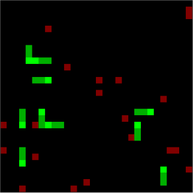
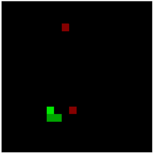

<div align="center">

# sneks_ai

</div>

<div align="center">

  

</div>

## Snake AI Game
This project implements an enhanced version of the classic Snake game, introducing AI-controlled snakes, multiple apples with decay rates, and additional game mechanics. The game is built using NumPy for numerical operations, showcasing a custom implementation of snakes that can act based on the game state, with the potential for neural network-based decision-making.


### Features
+ Multiple Snakes: The game supports multiple snakes on the board, including both player-controlled and AI-controlled snakes.
+ Dynamic Apples: Apples appear randomly on the board, providing score boosts and resetting snake hunger. Apples decay over time, affecting their value.
+ Enhanced Game Mechanics: Snakes grow when eating food, die upon running into walls or themselves, and have a hunger mechanism leading to death if not fed.
+ AI Integration: Placeholder for neural network-based decision making, allowing for the development of AI that learns optimal strategies.
+ Customizable Game Parameters: Various aspects of the game, such as board size, number of snakes and apples, and rewards, can be customized.

### Game Objects
+ Snake: Represents both player and AI snakes, capable of moving, growing, and dying based on game rules.
+ Apple: Placed randomly on the game board, providing rewards and decaying over time.

## Getting Started
To run the Snake AI game, you'll need Python installed on your system along with the necessary dependencies:
```
pip install numpy
```

## How It Works
The game initializes with a set number of snakes and apples on a grid. Each snake, controlled either by the player or AI, makes decisions based on the current state of the game board. The game progresses with each tick, where snakes move, eat apples, and potentially die due to various game mechanics.

## Customization
Modify the SnakeGame initialization parameters to customize the game experience:
```
game = SnakeGame(
    canvas_size=20, 
    nSnakes=1, 
    nApples=5, 
    dimensions=2, 
    step_Reward=-1, 
    apple_Reward=255, 
    snakebody_Reward=100, 
    snake_dieHunger=50, 
    gamma=0.98, 
    max_ticks=1000, 
    annotate=False
)
```

<div align="center">

  

Example showing the hunger dampening the color of the snake for visual effect

</div>


## Progress

### Brains
- [x] Integrate neural networks for each snake.
- [x] Neural network for each snake 
- [ ] Neuro Evolution
- [ ] Evolve in batches of nBatches
- [ ] Competition for Mate Choice
- [ ] Mutation rate as a function of related mates
- [ ] Indirect relationship between mutation and weight matrixes
- [ ] Genetic code
- [ ] Network Architecture
- [ ] Deep Q Learning
- [ ] During and post game learning
- [ ] Reward functions already built
- [ ] Neural Net visualization under Snake Class


### Features
- [ ] In Game Mating
- [ ] Coloring Based on Relatedness
- Line of Sight
    - Introduce Observation vs full Game State for Agent input
- Creatures 
    - Predator
    - Prey
- [ ] Food types
    - [x] Apples
- [ ] Obstacles


#### Biomes
- Alter likelyhood of:
    - Foodsource (water/desert/grassland)
    - Animal placement (shark/hen)
    - Winning headCollision (hill)
- [ ] Water
- [ ] Grass
- [ ] Desert
- [ ] Hill 
    

## Contributing
Contributions to the Snake AI game are welcome. Please feel free to fork the repository, make changes, and submit pull requests.